# manaVault

## Overview
ManaVault is a Django-based e-commerce web application for browsing and purchasing Magic: The Gathering cards from a curated personal collection. Users can register for an account, browse available cards, manage a shopping cart, securely complete purchases using Stripe test payments, and view their order history through a personal profile page. The project was intentionally scoped as a single-seller storefront to deliver core e-commerce functionality to a high standard, while allowing for future expansion into a wider card trading marketplace.

## 🚀 Live Project

👉 https://manavault-03c0788c9056.herokuapp.com/

---

## 🎯 UX Design

### Target Audience
- Trading card collectors  
- Hobbyists and gamers  
- Users looking for a simple online card store  

### User Goals
- Browse available cards  
- View detailed card information  
- Add items to a cart  
- Complete purchases securely  
- View previous orders  

### Design Decisions
- Clean Bootstrap layout for clarity and usability  
- Card-based UI for product browsing  
- Fully clickable product cards  
- Responsive design for mobile and desktop  
- Minimal friction checkout flow  

---

## ✨ Features

### 🔐 Authentication
- User registration 
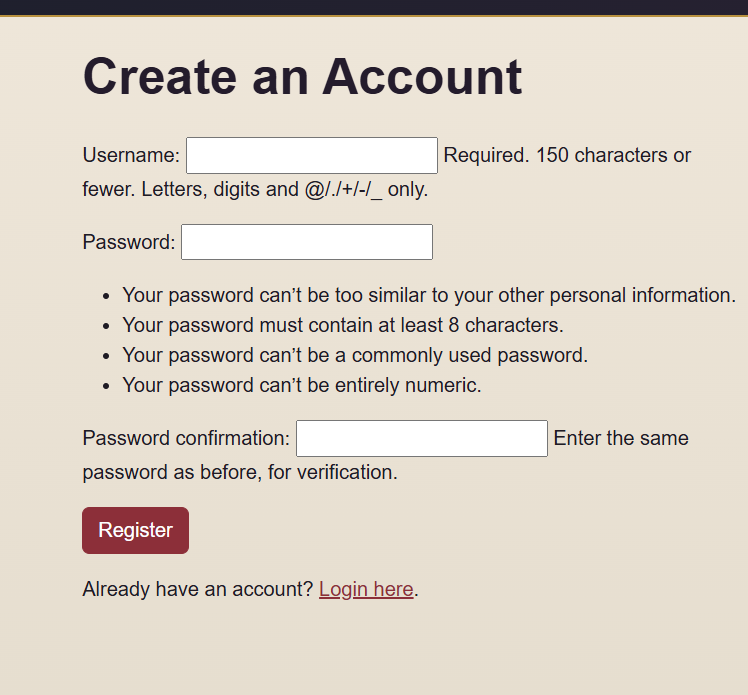
- Login and logout (secure POST logout)
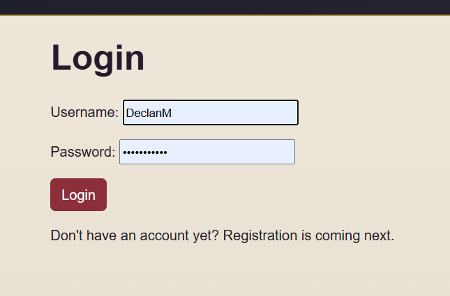  
- Profile page displaying order history
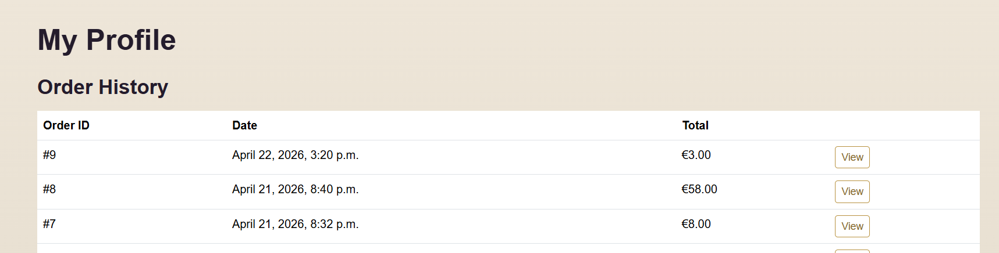  

### 🃏 Cards
- View all cards 
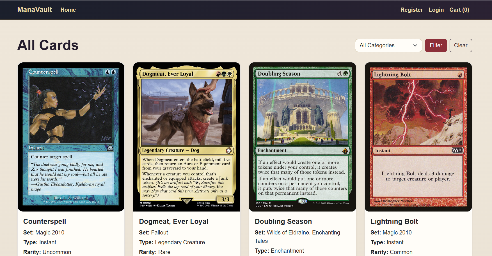 
- Card detail pages  
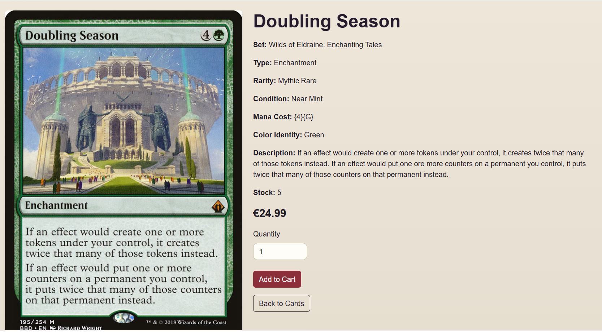
- Stock tracking  
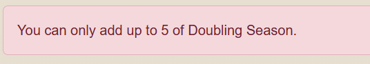
- Rarity and condition display
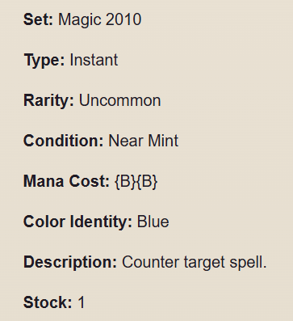  

### 🛒 Cart
- Add to cart (AJAX + POST fallback) 
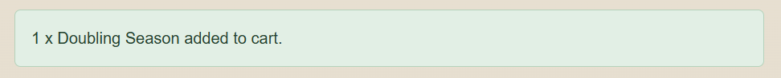 
- Update quantities  
- Remove items  
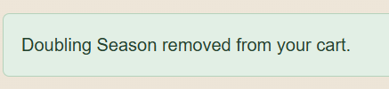
- Dynamic total calculation  

### 💳 Checkout (Stripe)
- Stripe Checkout integration  
[Stripe](documentation/stripe-pay.png)
- Secure payment handling  
- Order creation after successful payment 
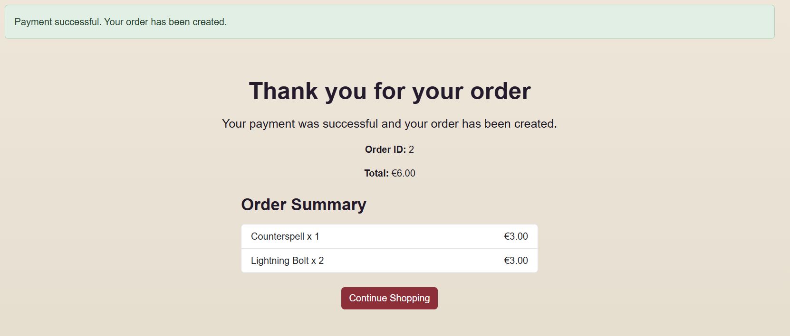 
- Automatic stock updates  

### 📦 Orders
- Orders stored with delivery details  
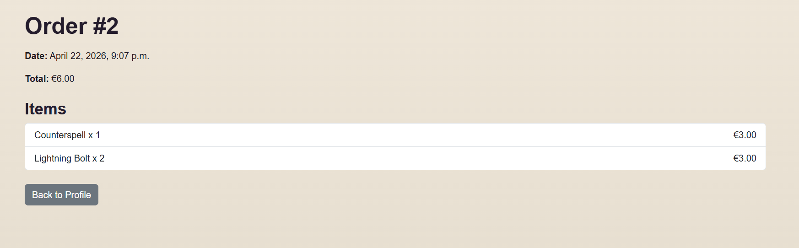
- OrderLineItems track purchased cards  
- Profile shows order history  

### 📩 Contact
- Contact form for user communication  
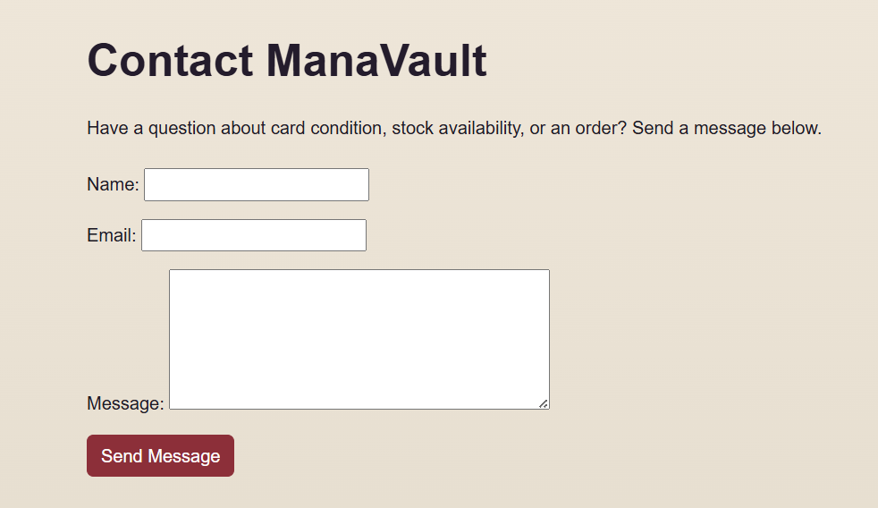

---
## 📖 User Stories

### As a visitor:
- I want to browse cards so I can see what is available  
- I want to view card details so I can make informed decisions  

### As a shopper:
- I want to add items to a cart so I can purchase multiple cards  
- I want to update quantities so I can control my order  
- I want to securely checkout so I can complete my purchase  

### As a registered user:
- I want to create an account so I can track my orders  
- I want to log in and out securely  
- I want to view my order history  

### As a site owner:
- I want to manage card stock via admin  
- I want to track orders placed  

---
## 📖 User Stories

### As a visitor:
- I want to browse cards so I can see what is available  
- I want to view card details so I can make informed decisions  

### As a shopper:
- I want to add items to a cart so I can purchase multiple cards  
- I want to update quantities so I can control my order  
- I want to securely checkout so I can complete my purchase  

### As a registered user:
- I want to create an account so I can track my orders  
- I want to log in and out securely  
- I want to view my order history  

### As a site owner:
- I want to manage card stock via admin  
- I want to track orders placed  

---
## 📖 User Stories

### As a visitor:
- I want to browse cards so I can see what is available  
- I want to view card details so I can make informed decisions  

### As a shopper:
- I want to add items to a cart so I can purchase multiple cards  
- I want to update quantities so I can control my order  
- I want to securely checkout so I can complete my purchase  

### As a registered user:
- I want to create an account so I can track my orders  
- I want to log in and out securely  
- I want to view my order history  

### As a site owner:
- I want to manage card stock via admin  
- I want to track orders placed  

---

## 🗃️ Database Schema

### Models

#### Card
- name  
- set_name  
- card_type  
- rarity  
- condition  
- mana_cost  
- color_identity  
- description  
- price  
- stock_quantity  
- image  
- is_active

#### Order
- user  
- full_name  
- email  
- phone_number  
- country  
- postcode  
- town_or_city  
- street_address1  
- street_address2  
- county  
- order_total  
- date  

#### OrderLineItem
- order (ForeignKey)  
- card (ForeignKey)  
- quantity  
- lineitem_total  

#### UserProfile
- user (OneToOne)  
- default delivery information  

---

## 🔗 Relationships

- One User → One UserProfile  
- One User → Many Orders  
- One Order → Many OrderLineItems  
- One Card → Many OrderLineItems  

---

## 📊 Entity Relationship Diagram

USER ||--|| USERPROFILE : has  
USER ||--o{ ORDER : places  
ORDER ||--o{ ORDERLINEITEM : contains  
CARD ||--o{ ORDERLINEITEM : appears_in  

The database is structured to support an e-commerce workflow.

Each user has a profile storing delivery information.  
Users can place multiple orders, and each order contains multiple items.  
Each order item links a card to an order, allowing multiple cards to be purchased in a single transaction.

---

## 🔐 Data Validation

- Users cannot exceed available stock  
- Quantity inputs are restricted by stock limits  
- Checkout requires valid input fields  
- Stripe handles secure payment validation  
- Orders are only created after successful payment  

---

## 🎨 Design Rationale

ManaVault balances a trading card aesthetic with a clean e-commerce layout.

### UI Decisions
- Grid layout improves browsing  
- Fully clickable cards enhance usability  
- AJAX interactions reduce page reloads  
- Consistent navigation improves UX  

### Styling
- Bootstrap is used for consistency  
- Colour scheme inspired by trading card themes  
- Focus on readability and clarity  

---

## 🧩 Agile Planning

The project was developed iteratively:

1. Project setup and app structure  
2. Card model and display  
3. Cart functionality  
4. Checkout and Stripe integration  
5. User authentication and profiles  
6. Deployment to Heroku  
7. UI improvements and debugging  

## Testing 

For all testing, please refer to the [TESTING.md](TESTING.md) file.

## ☁️ Media Storage (Cloudinary)

Images are stored using Cloudinary to ensure reliable media handling in production.

### Why Cloudinary?
- Heroku filesystem is temporary  
- Uploaded files are not persistent  
- Cloudinary provides cloud-based hosting  

### Implementation
- django-cloudinary-storage used  
- Environment variables for credentials  
- Images re-uploaded via admin  

---

## 🔐 Security

- No secrets stored in code  
- Environment variables used  
- CSRF protection enabled  
- Secure POST logout  
- Stripe handles payment security  

---

## 🎨 Future Improvements

- Advanced filtering  
- Search functionality  
- Improved MTG styling  
- Pagination  
- Email confirmations  
- Wishlist  
- Marketplace functionality  

---

## Tools & Technologies Used

---

### Databases
- SQLite (development)
- [PostgreSQL](https://www.postgresql.org) used as the production relational database.

---

### Languages used
- [HTML](https://en.wikipedia.org/wiki/HTML) - Used for the main site content.
- [CSS](https://en.wikipedia.org/wiki/Cascading_Style_Sheets) -Used for styling and colours
- [Bootstrap](https://getbootstrap.com) used as the front-end CSS framework for modern responsiveness and pre-built components.
- [JavaScript](https://en.wikipedia.org/wiki/JavaScript) - Used minimally for Bootstrap components and client-side interactions.
- [Google Dev Tools](https://developer.chrome.com/docs/devtools) - Used for troubleshooting, testing responsiveness, and styling.
- [GitHub](https://github.com/) - Used to save and store the project files.
- [Gitpod](https://www.gitpod.io/) - Cloud-based IDE for development
- [Git](https://git-scm.com/) - Used for version control. (git add, git commit, git push)
- [Heroku](https://dashboard.heroku.com/) - Live deployment of the site was hosted here
- [Django](https://www.djangoproject.com/) - Framework that helped build the site. 
- Django Admin enabled for secure backend management of users and bookings
- [Gunicorn](https://gunicorn.org/) used for WSGI server
- [Cloudinary] (https://cloudinary.com/) used for hosting images on the cloud server

---

## 📂 Project Structure

manavault/  
├── home/  
├── cards/  
├── cart/  
├── checkout/  
├── profiles/  
├── templates/  
├── static/  
├── media/  
├── requirements.txt  
├── Procfile  
├── .python-version  
└── manage.py  

## Deployment

### Heroku Deployment

The project was deployed to Heroku using the following steps:

1. Create Heroku app
2. Add PostgreSQL add-on
3. Configure environment variables:
   - SECRET_KEY
   - DATABASE_URL
4. Configure settings for production:
   - DEBUG = False
   - ALLOWED_HOSTS
   - CSRF and session security
5. Collect static files
6. Run migrations
7. Scale web dyno

The live application can be found here:  
https://manavault-03c0788c9056.herokuapp.com/

Heroku needs two additional files in order to deploy properly.
- requirements.txt
- Procfile

You can install this project's **requirements** (where applicable) using:
- pip3 install -r requirements.txt

If you have your own packages that have been installed, then the requirements file needs updated using:
- pip3 freeze --local > requirements.txt

The **Procfile** can be created with the following command:
- echo web: gunicorn app_name.wsgi > Procfile
- *replace **app_name** with the name of your primary Django app name; the folder where settings.py is located*

For Heroku deployment, follow these steps to connect your own GitHub repository to the newly created app:

Either:
- Select **Automatic Deployment** from the Heroku app.

Or:
- In the Terminal/CLI, connect to Heroku using this command: heroku login -i
- Set the remote for Heroku: heroku git:remote -a app_name (replace *app_name* with your app name)
- After performing the standard Git add, commit, and push to GitHub, you can now type:
	- git push heroku main

The project should now be connected and deployed to Heroku!

---

## Local Deployment

### Cloning the Repository

1. Go to the [GitHub repository.] (https://github.com/Dmolloy/manaVault.git).
2. Locate the Code button above the list of files and click it.
3. Select if you prefer to clone using HTTPS, SSH, or GitHub CLI and click the copy button to copy the URL to your clipboard.
4. Open Git Bash or Terminal.
5. Change the current working directory to the one where you want the cloned directory.
6. In your IDE Terminal, type the following command to clone my repository:
- git clone https://github.com/Dmolloy/manaVault.git
7. Press Enter to create your local clone.

### Forking 
By forking the GitHub Repository, we make a copy of the original repository on our GitHub account to view and/or make changes without affecting the original owner's repository. You can fork this repository by using the following steps:

1. Log in to GitHub and locate the [GitHub Repository](https://github.com/Dmolloy/manaVault.git).
2. At the top of the Repository (not top of page) just above the "Settings" Button on the menu, locate the "Fork" Button.
3. Once clicked, you should now have a copy of the original repository in your own GitHub account!

## Credits
- [Stack Overflow](https://stackoverflow.com/)- For help with learning proper syntax and troubleshooting tips
- [Code Institute](https://codeinstitute.net/) - Tutorials and engaging course work.
- [youtube](https://www.youtube.com/watch?v=PBcqGxrr9g8) - For helping with understanding live deployment using Heroku
- [favicon.io](https://favicon.io/emoji-favicons/books/) - For providing the favicon
-[Cardmarket](https://www.cardmarket.com/) - Where I sourced all of my iamges for this project.

## Acknoledgements
I would like to thank [Code Institute](https://codeinstitute.net/) for the lessons and guidance in working on this project. The [Discord Community](https://discord.com/) for the support to help continue moving with the project. 