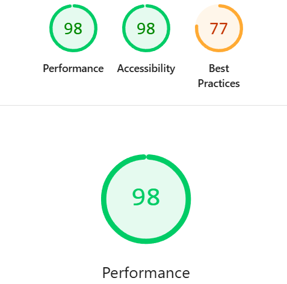
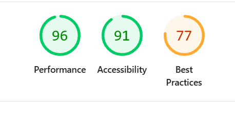
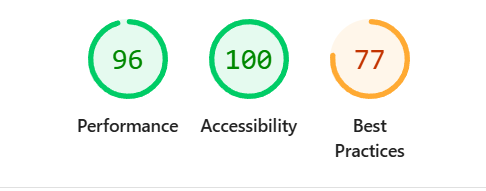
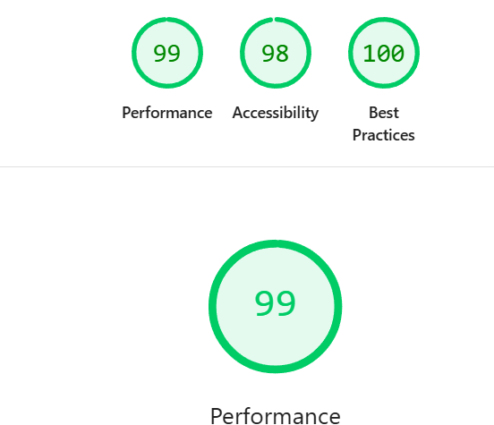

# ManaVault Testing

This document records the manual testing carried out for the ManaVault project, including feature testing, user flow testing, deployment testing, bug fixing, and screenshots as evidence.

---

Return back to the [README.md](README.md) file.

## Overview

Testing was carried out throughout development and again after deployment to Heroku. The aim was to ensure that all major functionality worked as intended, that edge cases were handled correctly, and that the deployed application behaved consistently with the local development version.

Testing covered:

- User authentication
- Card browsing and detail pages
- Cart functionality
- Checkout and Stripe payments
- User profile and order history
- Contact form
- Deployment and media handling
- Responsiveness and usability

---

## Testing Strategy

The project was primarily tested through manual testing, supported by real use-case flows. Each major feature was tested from the perspective of both a site visitor and a logged-in user.

Testing included:
- happy path testing
- edge case testing
- invalid input testing
- deployment testing
- bug fixing and retesting

---

## Manual Testing

## Code Validation

### HTML

I have used the recommended [HTML W3C Validator](https://validator.w3.org) to validate all of my HTML files.

### Navigation and General Site Layout

| Feature | Action | Expected Result | Actual Result | Pass/Fail |
|--------|--------|----------------|--------------|-----------|
| Navbar links | Click Home, Cards, Contact, Cart | User is taken to correct page | Worked as expected | Pass |
| Homepage cards | Click featured card | User is taken to card detail page | Worked as expected | Pass |
| Cards page cards | Click card image/title/card area | User is taken to card detail page | Worked as expected | Pass |
| Responsive navbar | Open site on smaller screen | Navbar collapses correctly | Worked as expected | Pass |
| Footer | View footer on multiple pages | Footer displays correctly | Worked as expected | Pass |

---

### Authentication Testing

| Feature | Action | Expected Result | Actual Result | Pass/Fail |
|--------|--------|----------------|--------------|-----------|
| Register | Submit valid registration form | Account is created | Worked as expected | Pass |
| Register validation | Submit invalid/empty fields | Errors shown to user | Worked as expected | Pass |
| Login | Submit correct login details | User is logged in | Worked as expected | Pass |
| Invalid login | Submit incorrect credentials | Error shown / login denied | Worked as expected | Pass |
| Logout | Click logout | User is logged out securely | Worked as expected | Pass |
| Profile access | Visit profile while logged in | User sees profile page | Worked as expected | Pass |
| Protected profile | Visit profile while logged out | User is redirected to login | Worked as expected | Pass |

---

### Cards Testing

| Feature | Action | Expected Result | Actual Result | Pass/Fail |
|--------|--------|----------------|--------------|-----------|
| Cards page loads | Visit cards page | All active cards display | Worked as expected | Pass |
| Card detail page | Click a card | Card detail page loads | Worked as expected | Pass |
| Card data display | View card detail page | Card name, image, set, rarity, price, etc. display | Worked as expected | Pass |
| Card filtering | Filter by category/type | Only matching cards are shown | Worked as expected | Pass |
| Out of stock display | View out-of-stock item | Item cannot be added to cart | Worked as expected | Pass |

---

### Cart Testing

| Feature | Action | Expected Result | Actual Result | Pass/Fail |
|--------|--------|----------------|--------------|-----------|
| Add to cart | Add valid quantity | Item added successfully | Worked as expected | Pass |
| AJAX add to cart | Add to cart from card detail page | Success message shown without page reload | Worked as expected | Pass |
| Cart counter | Add item using AJAX | Navbar cart count updates | Worked as expected | Pass |
| Add too many items | Add quantity above stock | Error shown, item not added beyond stock | Worked as expected | Pass |
| View cart | Visit cart page | Cart items display correctly | Worked as expected | Pass |
| Update quantity | Change quantity in cart | Quantity updates correctly | Worked as expected | Pass |
| Remove item | Remove card from cart | Item removed from cart | Worked as expected | Pass |
| Empty cart | Visit cart with no items | Empty cart message shown | Worked as expected | Pass |

---

### Checkout and Stripe Testing

| Feature | Action | Expected Result | Actual Result | Pass/Fail |
|--------|--------|----------------|--------------|-----------|
| Checkout page | Go to checkout with items in cart | Checkout page loads | Worked as expected | Pass |
| Empty cart checkout | Attempt checkout with empty cart | User redirected / blocked | Worked as expected | Pass |
| Stripe redirect | Submit checkout form | User redirected to Stripe Checkout | Worked as expected | Pass |
| Stripe payment | Use test card details | Payment succeeds | Worked as expected | Pass |
| Order creation | Complete Stripe payment | Order is created in database | Worked as expected | Pass |
| Stock reduction | Complete order | Card stock decreases correctly | Worked as expected | Pass |
| Cart clearing | Complete order | Cart is emptied | Worked as expected | Pass |
| Success page | Complete payment | Success page shown | Worked as expected | Pass |

### Stripe Test Card Used

4242 4242 4242 4242
Any future expiry date
Any CVC
Any postcode

## 👤 Profile and Order History Testing

| Feature | Action | Expected Result | Actual Result | Pass/Fail |
|--------|--------|----------------|--------------|-----------|
| Profile page | Visit profile | Profile loads correctly | Worked as expected | Pass |
| Order history | Place order and revisit profile | Previous orders are shown | Worked as expected | Pass |
| Order detail | View specific order | Correct order items and totals display | Worked as expected | Pass |
| Saved delivery info | Complete checkout while logged in | Profile delivery details saved | Worked as expected | Pass |
| Prefilled checkout | Return to checkout | Delivery fields prefill correctly | Worked as expected | Pass |

---

## 📩 Contact Form Testing

| Feature | Action | Expected Result | Actual Result | Pass/Fail |
|--------|--------|----------------|--------------|-----------|
| Contact page load | Visit contact page | Form displays correctly | Worked as expected | Pass |
| Valid form submission | Submit valid form | Success message shown | Worked as expected | Pass |
| Validation | Submit incomplete form | Validation errors shown | Worked as expected | Pass |

---

## 📱 Responsiveness Testing

Testing was carried out using browser developer tools and different viewport sizes.

| Screen Size | Result |
|------------|--------|
| Mobile | Layout remained usable, cards stacked correctly |
| Tablet | Navigation and cards displayed correctly |
| Desktop | Full layout displayed correctly |

---

## 🌐 Browser Testing

| Browser | Result |
|--------|--------|
| Google Chrome | Pass |
| Microsoft Edge | Pass |
| Safari | Pass

---

## 🚀 Deployment Testing

The project was deployed to Heroku with PostgreSQL and Cloudinary for media storage.

| Feature | Expected Result | Actual Result | Pass/Fail |
|--------|----------------|--------------|-----------|
| App deployment | Site loads successfully on Heroku | Worked as expected | Pass |
| PostgreSQL database | Production database connects correctly | Worked as expected | Pass |
| Static files | CSS/JS load correctly | Worked as expected | Pass |
| Cloudinary images | Card images display correctly | Worked as expected | Pass |
| Admin panel | Admin login works on deployed app | Worked as expected | Pass |

---

## 🐞 Bugs Found and Fixed

### 1. Missing template / wrong template names
- **Issue:** Card detail page failed due to incorrectly named template files.  
- **Fix:** Corrected template names and ensured views pointed to correct paths.  

### 2. `redirect` not defined
- **Issue:** Registration view failed with `NameError: redirect is not defined`.  
- **Fix:** Added the correct import in the view.  

### 3. Cards not showing on homepage
- **Issue:** Cards existed in admin but were not appearing on homepage.  
- **Fix:** Checked homepage view query and template loop.  

### 4. Add to cart redirecting poorly
- **Issue:** User was always redirected to cart after adding a card.  
- **Fix:** Updated flow so user stayed on the card detail page and received a success message.  

### 5. AJAX cart message error
- **Issue:** JavaScript success message failed due to a missing DOM element.  
- **Fix:** Added the missing message container and updated the JavaScript.  

### 6. Logout alignment / functionality
- **Issue:** Logout appeared misaligned and required POST handling.  
- **Fix:** Implemented logout using a hidden POST form styled as a navigation link.  

### 7. Stripe keys exposed / expired
- **Issue:** Stripe test keys were committed during development and later expired.  
- **Fix:** Removed keys from repository history, rotated keys, and used environment variables.  

### 8. Deployed homepage returning 500
- **Issue:** Heroku deployment failed due to incorrect imports in `home/urls.py`.  
- **Fix:** Corrected imports and debugged homepage rendering.  

### 9. Media not loading on Heroku
- **Issue:** Images were not persistent due to Heroku’s ephemeral file system.  
- **Fix:** Integrated Cloudinary and re-uploaded media files.  

---

## ⚠️ Validation and Edge Case Testing

### Stock Validation
- Attempted to add more copies of a card than available  
- Application correctly prevented this and displayed an error  

### Empty Cart Validation
- Attempted to visit checkout with an empty cart  
- Application correctly blocked checkout  

### Profile Ownership
- Verified users could only access their own order history  
- Order detail pages were restricted correctly  

### Form Validation
- Submitted incomplete registration, contact, and checkout forms  
- Validation errors displayed as expected  

## 🔍 Lighthouse Testing

Lighthouse testing was carried out on key pages to evaluate performance, accessibility, best practices, and SEO.

### Pages Tested
- Homepage  
- Cards page  
- Card detail page  
- Checkout page  

---

## 📊 Lighthouse Results Summary

| Page | Performance | Accessibility | Best Practices | SEO |
|------|------------|--------------|----------------|-----|
| Homepage |  | Pass/Minor warning |
| Cards Page |  | Pass/Minor warning |
| Card Detail |  | Pass/Minor warning |
| Checkout |  | Pass |

---

## 🛠 Improvements Made

Based on Lighthouse feedback, the following improvements were implemented:

- Added explicit `width` and `height` attributes to images to reduce layout shift  
- Implemented `loading="lazy"` on images to improve performance  
- Added `alt` attributes to all images for accessibility  
- Ensured all buttons and form elements had accessible labels  
- Corrected heading hierarchy for better navigation and accessibility  

---

## ⚠️ Known Issues and Considerations

Some Lighthouse warnings remain but were considered acceptable within the scope of the project:

### Third-Party Cookies
- Warnings were generated by Cloudinary (image hosting) and Stripe  
- These services set cookies outside of the application’s control  

### Render-Blocking Resources
- Bootstrap CSS and external scripts are loaded via CDN  
- These improve development efficiency but may slightly impact performance  

### Unused CSS
- Bootstrap includes unused styles by default  
- Removing these would require significant restructuring and was not necessary for this project  

### Image Optimisation
- Multiple card images increase page load size  
- This is expected for an image-heavy e-commerce site  

---